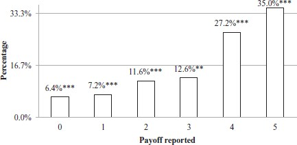
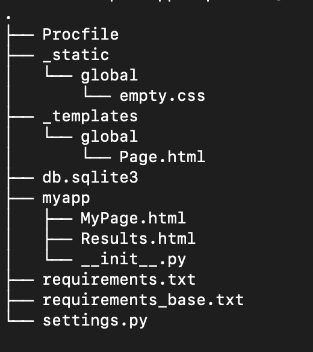
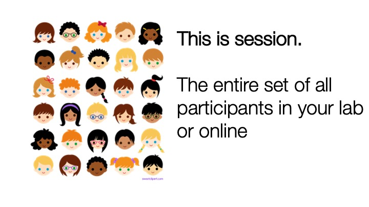
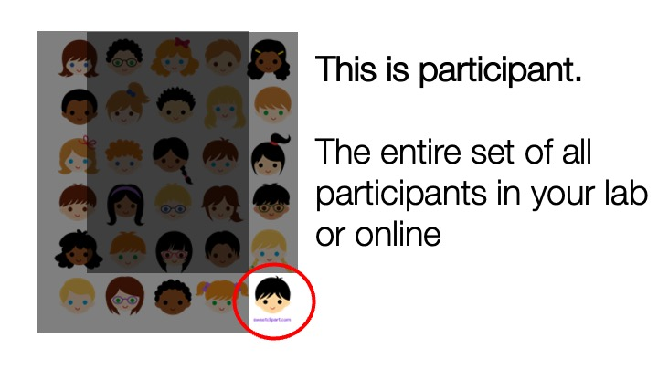
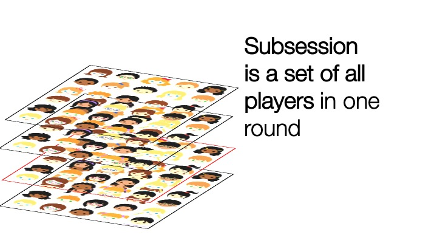
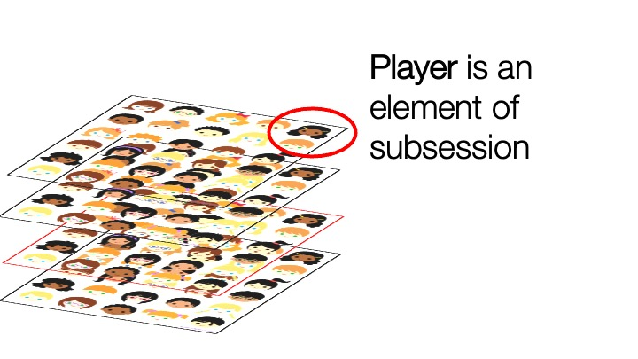
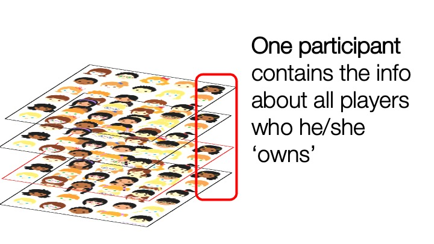
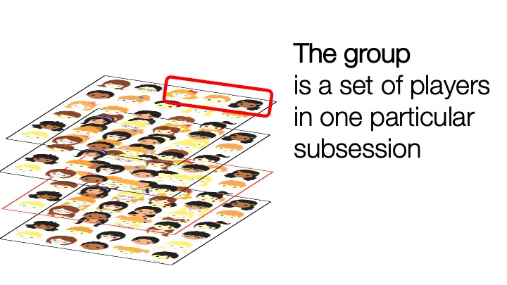
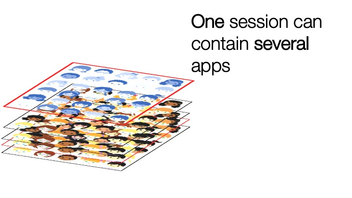

```{r setup, include=FALSE}
knitr::opts_chunk$set(echo = FALSE, cache=TRUE, fig.align = 'center')
```

## Plans for the week

-   Cheating game [@fischbacher2013lies]
-   Dictator game [@kahneman1986fairness]
-   Ultimatum game [@guth1982experimental]
-   Trust game [@berg1995trust]
-   Public good game [@fehr2000cooperation]


## Code and demo:

- Code: <https://github.com/chapkovski/spbss_code>

- Demo app: <https://spbss.herokuapp.com/>

- Presentation (these slides:) <https://github.com/chapkovski/spbss/tree/main/pres/ready>

## Cheating game

-   Profit depends on the number reported on a die

{width="65%"}

## Cheating game

Benefits:

-   Super simple to understand
-   Veil of anonymity
-   Single player game

## oTree - intro

Start new project: - Open a terminal (command line, power shell in Windows, Terminal on MacOS or Linux)

``` {.bash}
otree startproject NAME_OF_THE_PROJECT
```

-   Choose 'NO' when you are asked whether to add standard games.

## oTree - intro

Change to the project folder:

``` {.bash}
cd NAME_OF_THE_PROJECT
otree startapp NEW_APP
```

## Project structure

{height="80%"}

## App structure

-   main python file (`__init__.py`)
-   HTML files for specific pages

Within `__init__` file:

-   Constants
-   Models
-   Pages
-   page sequence

## App registration

App is just a folder with some files in it. To make it visible for oTree you need to add it to the `settings.py` file, to the `SESSION_CONFIGS` section:

``` {.python}
SESSION_CONFIGS = [
    dict(
        name='dice',
        app_sequence=['dice'],
        num_demo_participants=1,
    ),
    ]
```

## App registration

`SESSION_CONFIGS` is a right point for introducing treatments, like that:

```python
SESSION_CONFIGS = [
    dict(
        name='dice',
        app_sequence=['dice'],
        num_demo_participants=1,
        beliefs=False
    ),
        dict(
        name='dice_belief',
        app_sequence=['dice'],
        num_demo_participants=1,
        beliefs=True
    ),
    ]
```
If you introduce treatments you can refer to the session.config later like that: ```player.session.config['beliefs']```


## Running the app:

`otree devserver` will make it running at the address <http://localhost:8000>

(You can run it on another port by adding port number after `devserver`)

## Publishing the app

-   Register at Heroku (you'll need your credit card info)

-   Download GIT and Heroku CLI (here: <https://devcenter.heroku.com/articles/heroku-cli>)

-   Terminal -\> Project folder -\>:

    -   `heroku create APPNAME`
    -   \`git add . & git commit -m 'my commit'
    -   `git push heroku`

## Building a Cheating game:

-   Planning the page structure
-   Planning the data structure
-   Writing instructions
-   Testing

## Cheating game: page structure

-   Instructions
-   Decision (show them instructions again)
-   Beliefs (if we are in `Beliefs` treatment)
-   Results with payoff

## Cheating game: data structure

We need to store only two pieces of info provided by a user:

-   answer (integer number from 1 to 6)
-   belief about an average answer of others (a float number from 1 to 6)

## Cheating game: Writing instructions

We just borrow Follmi-Heusi instructions and adapt them:

<https://academic.oup.com/jeea/article/11/3/525/2300098?login=true#58872029>

We re-use instructions in several pages using `include` statement
```jinja
{{ include 'dice/includes/instructions.html' }}
```

## Cheating game: Testing

In addition to 'manual' testing we can write bots in oTree
```python
class PlayerBot(Bot):
    def play_round(self):
        yield Intro,
        yield Decision, dict(answer=random.randint(1, 6))
        if self.session.config.get('beliefs'):
            yield Belief, dict(belief=random.randint(1, 6))
        yield Results
```
and run them either by 
```otree test dice```
or by using browser bots. Include `use_browser_bots` option to the session config:
```python
SESSION_CONFIG_DEFAULTS = dict(
    real_world_currency_per_point=1.00,
    participation_fee=0.00, 
    doc="",
    use_browser_bots=False,
)
```


## Anatomy of oTree pages

Each page (aka screen in z-Tree terminology) has three key elements:

- class
- html template
- position in a page sequence


## Anatomy of oTree pages - two types of pages

- Page (aka _normal_ page)
- WaitPage

Reaching the WaitPage in a page sequence, participants **wait** till all the members of their group 
or all the members of the entire experimental session reach the same page.


## Anatomy of oTree pages - class

```python
class Decision(Page):
    form_model = 'player'
    form_fields = ['answer']
    before_next_page = set_payoff


class Belief(Page):
    form_model = 'player'
    form_fields = ['belief']

    @staticmethod
    def is_displayed(player: Player):
        return player.session.config.get('beliefs', False)

```

## Anatomy of oTree pages - class

Page has several built-in methods:

- is_displayed
- vars_for_template
- before_next_page

`WaitPage` has most of the methods above (with an exception of `before_next_page`)
and a few others, the most important one is:

- after_all_players_arrive

## Anatomy of oTree database - models

{height="90%"}

## Anatomy of oTree database - models

{height="90%"}


## Anatomy of oTree database - models

{height="90%"}

## Anatomy of oTree database - models

{height="90%"}


## Anatomy of oTree database - models

{height="90%"}


## Anatomy of oTree database - models

{height="90%"}


## Anatomy of oTree database - models

{height="90%"}


## Chaining the apps:

```python
SESSION_CONFIGS = [
    dict(
        name='dice_and_dg',
        display_name='Dice game + Dictator game',
        app_sequence=['dice', 'dg'],
        num_demo_participants=2,
    )
    ]
```

## Anatomy of oTree database - models

Where to store the data? Subsession? Group? Player?

**Rule of thumb:** _put it to the level of the highest variability_

Example: Dictator game:

```python

class Group(BaseGroup):
    kept = models.CurrencyField()


class Player(BasePlayer):
    age = models.IntegerField()

```


## Anatomy of oTree database - models

Some field parameters may be set statically:

```python
class Player(BasePlayer):
    age = models.IntegerField(min=18, max=100, label='How old are you?')
    gender = models.StringField(choices=['Male', 'Female'],
                                widget=widgets.RadioSelect)
    
```    

## Anatomy of oTree database - models

The field parameters may be set dynamically:
```python
import random
class Player(BasePlayer):
    voting  = models.StringField(label='Who will you vote for at 2022 midterms?')

def voting_choices(player):
    choices = ['Republican', 'Democrat']  
    random.shuffle(choices)
    return choices ## NB! this one will not store the order in the DB!
    
```    
Other dynamically set options: `_max`, `_min`, `_error_message`, and PAGE `_error_message`


## Anatomy of oTree  - Constants

At the top of `__init__` file there is a `Constants` section. Use it as **SSOT**

\bcenter

**SSOT (Single Source of Truth)**

\ecenter

### WRONG:

```python
class Player(BasePlayer):
    send  = models.IntegerField(min=0, max=100, 
label='How much you would like to send to charity (from 0 to 100)?')
```
### RIGHT:

```python
class Constants(BaseConstants):
    ...
    endowment = 100
class Player(BasePlayer):
    send  = models.IntegerField(min=0, max=Constants.endowment, 
label=f'How much you would like to send to charity'
      f'(from 0 to {Constants.endowment})?')

```

## Anatomy of oTree  - Constants

Some built-in values of Constants include:

```python
class Constants(BaseConstants):
    name_in_url = 'dictator'
    players_per_group = 2
    num_rounds = 1
    instructions_template = 'dictator/instructions.html'
    # Initial amount allocated to the dictator
    endowment = cu(100)
    dictator_role = 'Participant A'
    recipient_role = 'Participant B'
```


## Dictator game - planning

- Two players game
- Asymmetric: two different roles (*Dictator* and *Recipient* )
- Payoffs: 
  - Dictator decides how much to send out of endowment. The rest is his/her payoff

## Dictator game - pages

  - Intro
  - Decision (for *Dictator*)
  - Belief about Dictator's decision (for *Recipient&*)
  - Waiting for Dictator's decision
  - Results
  
## Dictator game - pages

  ```python
  page_sequence = [
    Intro,
    Decision,
    Belief,
    ResultsWaitPage,
    Results
]
  ```


## Dictator game - pages

  ```python
 class Decision(Page):
    form_model = 'group'
    form_fields = ['send']

    @staticmethod
    def is_displayed(player: Player):
        return player.role == Constants.dictator_role


class Belief(Page):
    form_model = 'group'
    form_fields = ['belief']

    @staticmethod
    def is_displayed(player: Player):
        return player.role == Constants.recipient_role


class ResultsWaitPage(WaitPage):
    after_all_players_arrive = set_payoffs
  ```


## Dictator game - role assignment and other constants:

```python
class Constants(BaseConstants):
    name_in_url = 'dictator'
    players_per_group = 2
    num_rounds = 1
    # Initial amount allocated to the dictator
    endowment = cu(100)
    dictator_role = 'Participant A'
    recipient_role = 'Participant B'
```


## Dictator game - models:

```python
class Group(BaseGroup):
    send = models.CurrencyField(
        doc="""Amount dictator sends to a Recipient""",
        min=0,
        max=Constants.endowment,
        label=f"I will send to {Constants.recipient_role}",
    )
    kept = models.CurrencyField()
    belief = models.CurrencyField()

```

## Dictator game - payoff calculations:

```python
def set_payoffs(group: Group):
    dictator = group.get_player_by_role(Constants.dictator_role)
    recipient = group.get_player_by_role(Constants.recipient_role)
    group.kept = Constants.endowment - group.send
    dictator.payoff = group.kept
    recipient.payoff = group.send

```

## HTML templates and fields from database:

```python
 class Decision(Page):
    form_model = 'group'
    form_fields = ['send']

```
and in the html template:
```html
{{ formfields }}
```
OR:

```html
 {{ formfield player.send }}
```

## HTML templates:

```html
{{ block title }}
  Decision
{{ endblock }}
{{ block content }}
  <div class="alert alert-info">You are {{player.role}}</div>
  {{ formfields }}
  {{ next_button }}
  {{ include 'dg/includes/instructions.html' }}
{{ endblock }}
```


## HTML templates:

Instead of rendering all the fields we can render a single one:


```html
{{ block content }}
  <div class="alert alert-info">You are {{player.role}}</div>
  <h5>Try to guess how much <b>{{Constants.dictator_role}}</b> will send you? </h5>
  {{ formfield player.belief label=''}}
  {{ next_button }}
  {{ include 'dg/includes/instructions.html' }}
{{ endblock }}
```

## HTML templates:

We can render any variable from the database or from `Constants`:

```html

Your endowment was {{Constants.endowment}}.

{{Constants.dictator_role}} has sent you {{group.send}}.

```


## HTML templates:

You can use loops to render lists and arrays:
```python
class Constants(BaseConstants):
    payoffs = {1: 1, 2: 2, 3: 3, 4: 4, 5: 5, 6: 0}
```

```html
<table class="table">
  <tr>
      {{ for i in Constants.payoffs.keys }}
      <td>{{i}}</td>
      {{endfor}}
  </tr>
  <tr>
       {{  for j in Constants.payoffs.values }}
      <td>{{j}}</td>
      {{ endfor }}
  </tr>
</table>
```

## HTML templates:

You can use `if` conditions in  templates:

```html
<div class="my-3">
    {{ if player.role == Constants.dictator_role }}
    You decided to keep <strong>{{ group.kept }}</strong> for yourself.
    {{ else }}
    {{Constants.dictator_role}} decided to keep <strong>{{ group.kept }}</strong>, so
    you got <strong>{{ group.send }}</strong>.
    {{ endif }}
</div>
```


## References {.allowframebreaks}
